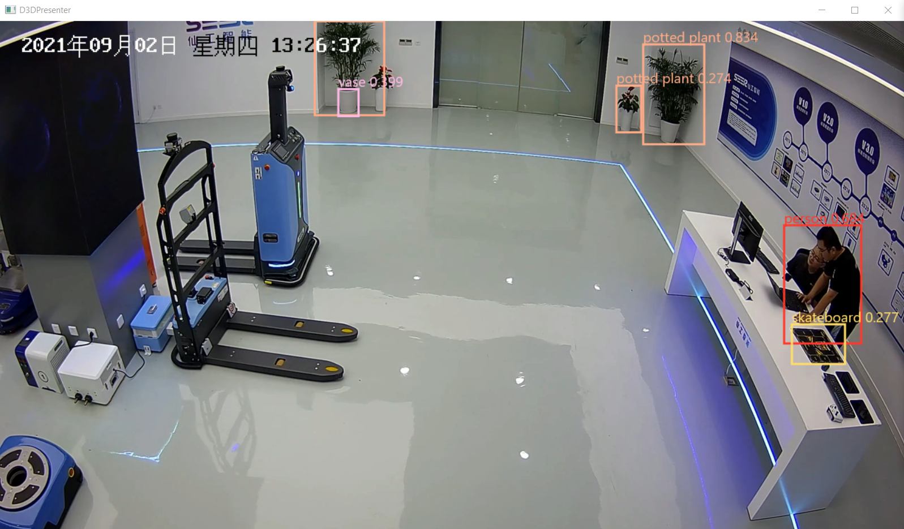

# Yolo_TRT_Cuvid

#### 介绍
GPU全流程解码，推理，绘图，推流。模型网络为YoloV5，TensorRT8推理平台。
可进行多路视频实时推理推流，硬解码与推理代码参考NVIDIA的Video_Codec_SDK，绘图使用Direct11。


#### 依赖

1.  CUDAv12.3
2.  visual studio 2022

#### 使用说明
因为无法push超过100M的文件，TensorRT-8.6.1.6采用分卷压缩形式，请拉取后手动解压！！

##### 编译：
```shell
1.  mkdir build && cd build
2.  cmake .. -DCMAKE_BUILD_TYPE=Release
3.  msbuild yolo_trt_nvcodec.sln /p:Configuration=Release
```
如果在打开vs2022进行编译，需要切换Release进行编译

##### 运行：
```shell
yolotrt.exe --inputUrl=06_720p.mp4;02.mp4 --pushUrl=rtmp://127.0.0.1:1935/live1;rtmp://127.0.0.1:1935/live2

--inputUrl 为多个输入流，可以是本地视频文件，也可以是RTSP,RTMP流，用;进行分隔
--pushUrl 为多个推理服务器地址流，用;进行分隔
注意输入流个数与推理流个数需保证相同
```
##### 运行效果：



#### 仅解码+推理可实现(Tesla P4) 8路720P视频，平均90ms延时；(RTX4090)8路720P视频，平均9ms延时
#### 解码+推理+绘图显示+推流可实现(Tesla P4) 8路720p视频，平均108ms延时；(RTX4090)8路720P视频，平均17ms延时


#### 注意事项

1.  weights附带了Ada Lovecave架构（40系）的模型，Ampere,Turing,Pascal等架构需要自己从onnx转换模型，engine文件统一为yolov5s_fp16.trt。
    转换完成复制到weights的对应文件夹内。
2.  yolov5的onnx文件input size为[1x3x384x640]，output size为[1x15120x85]


